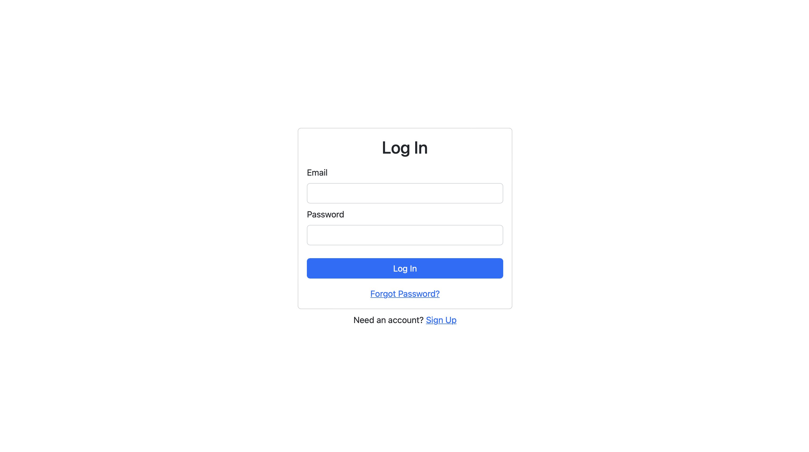
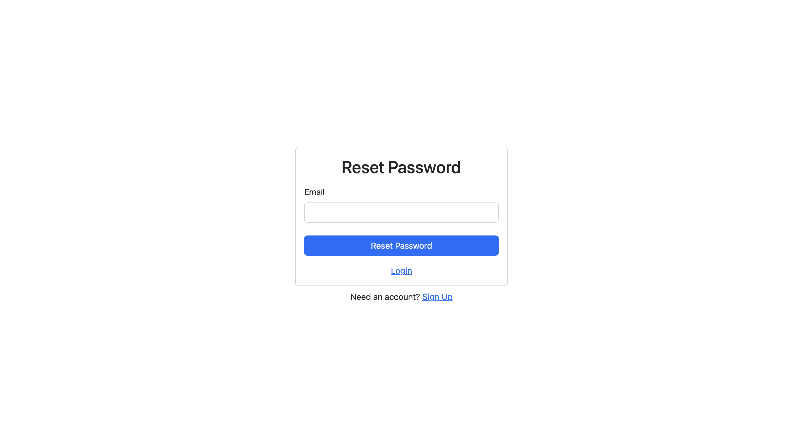
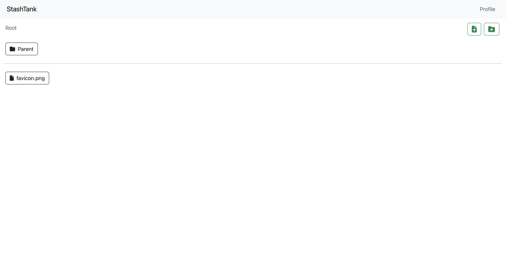
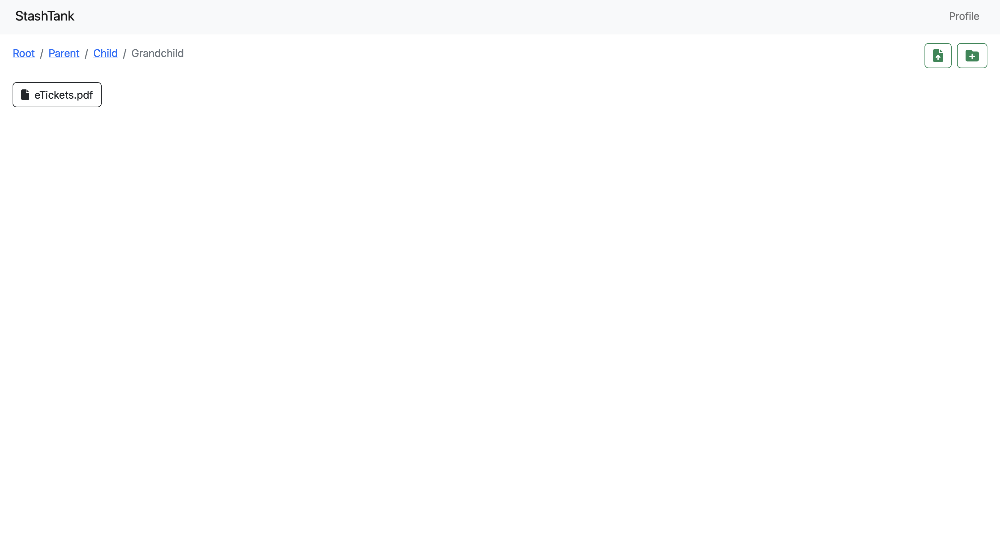

# StashTank

## 🚀 About

This is a web application that allows users to store and manage files and folders, similar to the popular cloud storage service, Google Drive.

## Features

This app includes the following features:

- User authentication using Firebase.
- Navigation between different folders (nested folders).
- The ability to upload, download files.
- Responsive design that works on desktop and mobile devices.

## Technologies Used

This app was built using the following technologies:

- Node.js
- React.js
- Bootstrap

## Run Locally

To get started with this app, you will need to have the following installed on your computer:

- Node.js
- npm

Clone the project

```bash
  git clone https://github.com/sttvk/StashTank.git
```

Go to the project directory

```bash
  cd StashTank
```

Install dependencies

```bash
  npm install
```

Set the following environment variables:

Login and create a project on Firebase to get the following keys

- `VITE_FIREBASE_API_KEY`
- `VITE_FIREBASE_AUTH_DOMAIN`
- `VITE_FIREBASE_PROJECT_ID`
- `VITE_FIREBASE_STORAGE_BUCKET`
- `VITE_FIREBASE_MESSAGING_SENDER_ID`
- `VITE_FIREBASE_APP_ID`

Run `npm start` to start the app.

Open your web browser and navigate to `http://localhost:3000` to use the app.

## Screenshots





